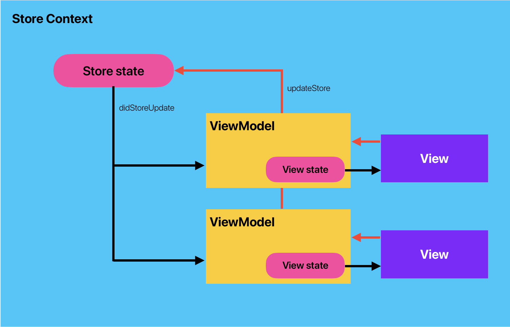

# ``Chiui``

Chiui: context-based unidirectional state management for SwiftUI

## Overview

Chiui is a lightweight state management approach for SwiftUI that enforces unidirectional state flow using a context/store/view model.

## Core Components



## Getting Started

### 1. Define Your States

```swift
// Global store state
struct AppStoreState: ContextualStoreState {
    var user: User?
    var settings: AppSettings
    var isAuthenticated: Bool = false
}

// Local view state
struct ProfileViewState: ContextualViewState {
    var displayName: String = ""
    var isEditing: Bool = false
    var isSaving: Bool = false
    var validationError: String?
    
    init() {} // Required empty initializer
}
```

### 2. Create Store and Context

```swift
// Create store
let store = ContextualStore(AppStoreState(settings: .default))

// Create context
let context = AppContext(store: store)
```

### 3. Implement View Model

```swift
final class ProfileViewModel: ContextViewModel<AppContext, ProfileViewState> {
    nonisolated override func didStoreUpdate(_ storeState: AppStoreState) async {
        await updateState { viewState in
            viewState.displayName = storeState.user?.name ?? ""
            viewState.isSaving = false
        }
    }
    
    func updateName(_ name: String) {
        Task {
            await updateState { state in
                state.displayName = name
                state.validationError = validateName(name)
            }.then { [weak self] change in
                guard
                    let self,
                    change.newState.validationError == nil
                else { return }
                
                // Update global state
                self.updateStore { storeState in
                    storeState.user?.name = change.newState.displayName
                }
                
                // Save to backend
                await self.saveUserProfile(name: change.newState.displayName)
            }
        }
    }
    
    func startEditing() {
        updateState { state in
            state.isEditing = true
        }
    }
}
```

### Concurrency Semantics

- `updateState(_:)` is synchronous and can be used directly in sync action methods.
- Chaining with `.then(_:)` is asynchronous and must be called from an async context (for example `Task { await ... }`).
- Inside `.then`, prefer data from `change.newState`/`change.oldState` instead of reading actor-isolated `state` from a sendable closure.

### 4. Use in SwiftUI

```swift
struct ProfileView: ContextualView {
    @StateObject var viewModel: ProfileViewModel
    
    init(_ context: AppContext) {
        _viewModel = .init(wrappedValue: .init(context))
    }
    
    var body: some View {
        VStack {
            if state.isEditing {
                TextField("Name", text: bindTo(\.displayName) { viewModel.updateName($0) })
            } else {
                Text(state.displayName)
                    .onTapGesture {
                        viewModel.startEditing()
                    }
            }
            
            if let error = state.validationError {
                Text(error).foregroundColor(.red)
            }
        }
    }
}
```

## Requirements

- iOS 16.0+
- macOS 13.0+
- Swift 5.9+
- Xcode 15.0+

